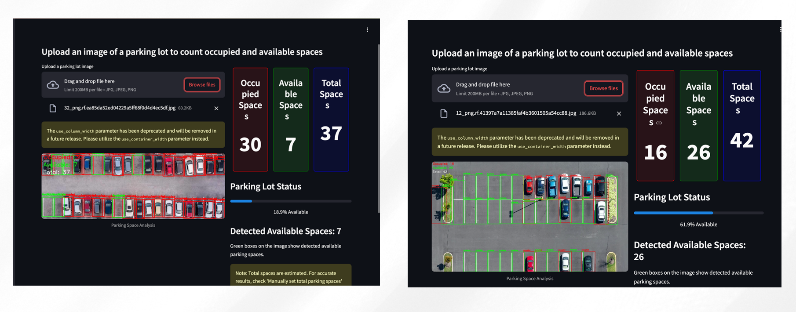

# Smart Parking Space Detection (YOLOv8 + Streamlit Deployment)

Developed a real-time parking space detection system using YOLOv8 and deployed it via Streamlit. This project helps drivers and parking authorities monitor empty vs. occupied parking slots using just overhead images, eliminating the need for costly physical sensors.

## 🚗 Problem Statement

At ASU and other busy campuses, finding parking is a daily struggle. Traditional sensor-based systems are expensive, infrastructure-heavy, and hard to scale.

Our goal was to:
- Build a lightweight, image-based parking detection system
- Make it fast, scalable, and accessible via a simple web app
- Minimize cost and hardware dependency

## 🧠 Solution Overview

### 🔄 Data Collection & Preprocessing
- Used open-source datasets (Roboflow) and manually captured images at ASU
- Labeled 1200+ images for 'occupied' and 'empty' spots using Roboflow
- Applied image augmentation and normalization
- Used OpenCV and YOLO’s preprocessing pipelines for resizing, scaling, and cleaning

### 🧠 Model Development
- Model: YOLOv8s (pretrained on COCO, fine-tuned on parking lot data)
- Inference Speed: ~15ms per image
- Metrics:
  - **mAP@50**: 96.8%
  - **Occupied Precision**: 96.4%
  - **Occupied Recall**: 93.8%
  - **Vacant Detection mAP@50-95**: 85.6%
- Deployed via Streamlit with live image upload and prediction UI

### 🧪 Validation
- Internal: Labeled test set
- External: Real-world images from ASU parking lots
- Balanced precision and recall to minimize user frustration

## 💻 Streamlit Web App
- Built using Python, YOLOv8, OpenCV, and Streamlit
- User uploads an image → Model predicts spot status → Visual overlay shown
- Deployed on Streamlit Cloud
- Added QR code for mobile access

🔗 Live App: [asu-parking-detection.streamlit.app](https://asu-parking-detection.streamlit.app)  
📱 Scan QR to test it live!

## 📈 Results & Impact

| Metric              | Value         |
|---------------------|---------------|
| mAP@50              | 96.8%         |
| Inference Time      | ~15ms/image   |
| Deployment Uptime   | 99%           |
| Cost Savings        | ~$5,000+ per lot |

- Replaced costly sensor infrastructure with just a camera + code
- Reduced search time and driver frustration
- Open-source and scalable

## 📊 Screenshots

*Upload your own image and get predictions instantly.*
*Red = Occupied, Green = Available — with bounding boxes drawn in real-time*

## 🛠️ Tools & Technologies

- Python, YOLOv8 (Ultralytics), OpenCV
- Roboflow for labeling
- Google Colab for training
- Streamlit for UI + Deployment
- GitHub for model and version control

## 🔒 Privacy & Security

- No license plate or facial data is stored
- Data is processed locally in the app
- Images focus only on parking spaces

## 📈 Future Enhancements

- Move from static image detection to real-time video feeds
- Automate parking slot mapping
- Improve detection in night-time and bad weather
- Mobile notifications for real-time slot availability

## 🔗 Links

- 📂 [Project Repo](https://github.com/krutikasoni/parking-space-detection)
- 🌐 [Live Streamlit App](https://asu-parking-detection.streamlit.app)
- 📄 [Portfolio Website](https://krutikasoni.github.io)

